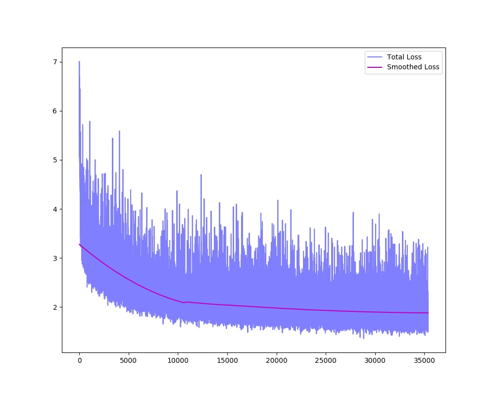

# AdaIN-StyleGAN
My implementation of the paper "Arbitrary Style Transfer in Real-time with Adaptive Instance Normalization" ([here](https://arxiv.org/pdf/1703.06868.pdf)).

## Training
Batch size of 1 due to memory limitations, not enough epochs and the learning rate should be higher and the style-content factor is made from trial and error, but here is the total loss over time of the training:

## Results

